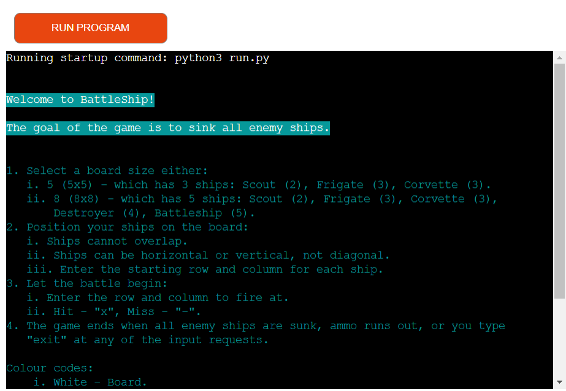

# Battleship Game

This is a command-line version of the classic Battleship game where you'll challenge yourself to strategically place your fleet and outsmart your opponent by sinking their ships before they sink yours.

## Contents

* [Purpose](#purpose)
* [Design](#design)
* [Playing the game](#playing_the_game)
* [Testing](#testing)
* [Validator Testing](#valivador_testing)
* [Manual Testing](#manual_testing)
* [Deployment](#deployment)
* [Requirements](#requirments)
* [Credits](#credits)

## Purpose

The Battleship Game provides users with a fun and engaging way to play the classic Battleship game in a digital format. It challenges players to think strategically about ship placement and guesswork, honing their logical thinking and pattern recognition skills.

## Design

My design process consisted of thinking of each logic step in the game then creating a flowchart detailing the steps as seen below. 

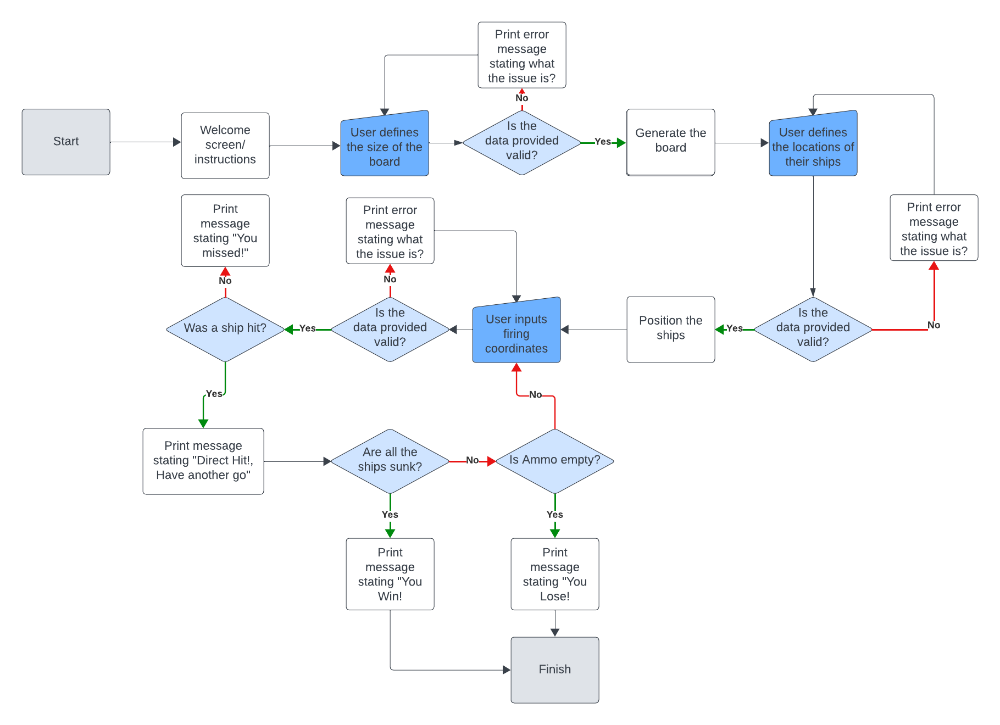

### Playing the game

 1. Open the game in your web browser.
 2. Select the board size
 3. Position your ships
 4. Attack the enemy ships

## Testing

I have tested this project by:

- Running the game in my local terminal and on the Code Institute's Heroku app.
- Passing the code through the PEP8 validator.
- Providing invalid inputs (e.g., text instead of numbers, symbols where not expected) to ensure error handling is robust.

### Validator Testing

- PEP8
    - Initially, some PEP8 errors were present. After fixing these errors, the code maintained functionality and passed the validator without issues.

### Manual Testing

#### Test 1: Game Initialization

- Step: Launch the game in a terminal.
- Expected Result: The game should start without errors and display the opening screen.
- Actual Result: The game started without any errors and displayed the opening screen.

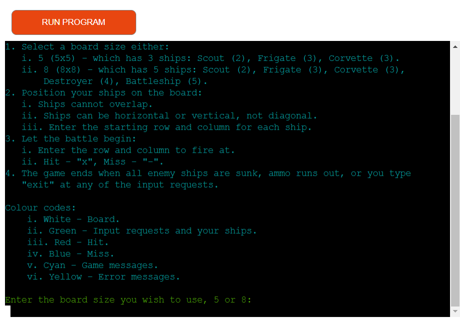

#### Test 2: Board Size Selection

- Step: Select a board size from the options.
- Expected Result: The game should accept the input of the board size, display the board and proceed to ship placement.
- Actual Result: The game accepted the input of the board size, displayed the board and proceeded to ship placement.

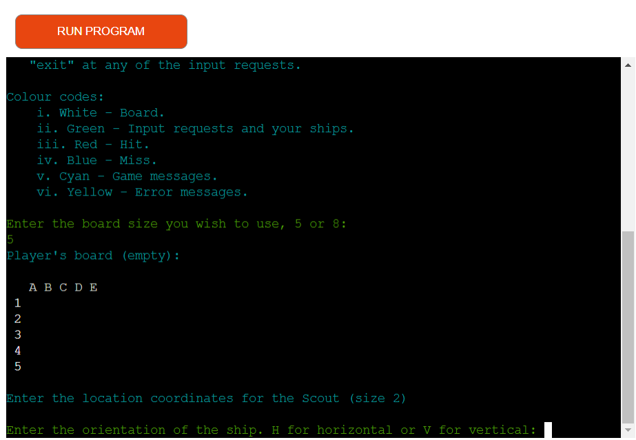

#### Test 3: Invalid Board Size Selection

- Step: Attempt to select a board size other than the options.
- Expected Result: The game should reject the input and prompt the player to choose a valid board size.
- Actual Result: The game rejected the input of the board size and prompted the user to choose a valid board size.

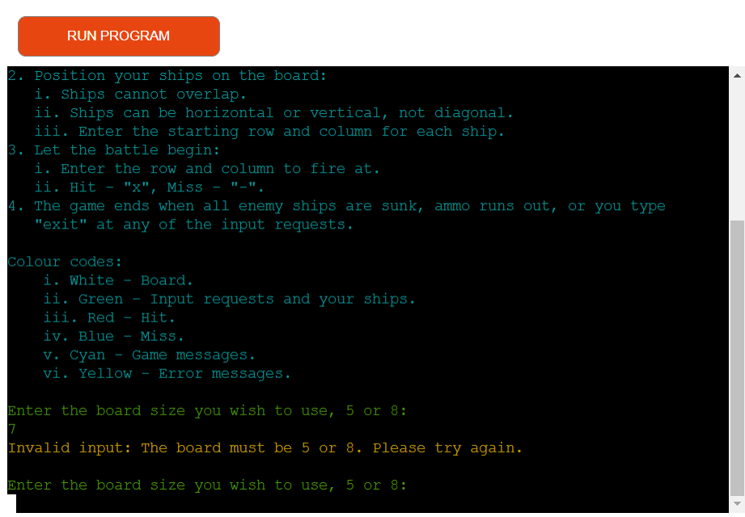

#### Test 4: Ship Placement

- Step: Place ships on the board manually.
- Expected Result: Ships should be placed according to the player's input, and the board should display the updated layout.
- Actual Result: Ships are placed according to the player's input, and the board is displayed with the updated layout.

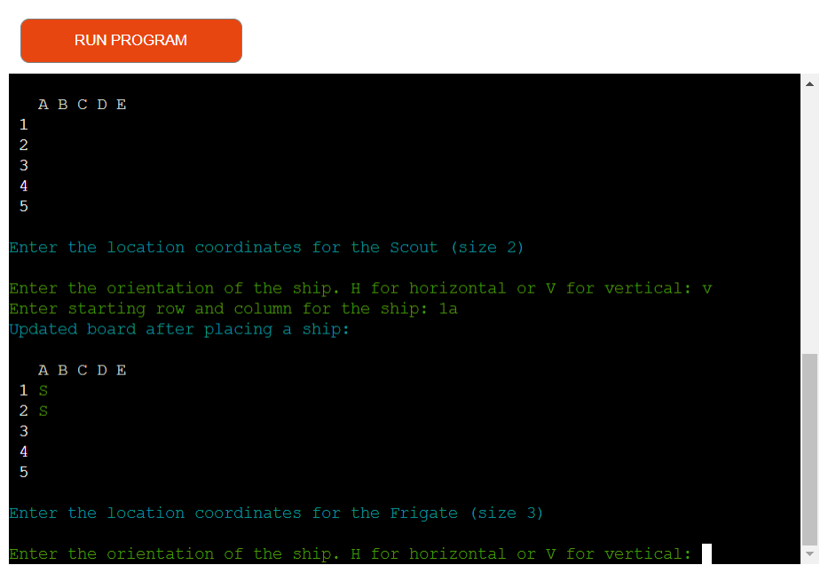
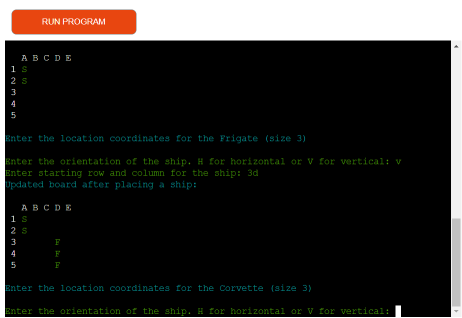
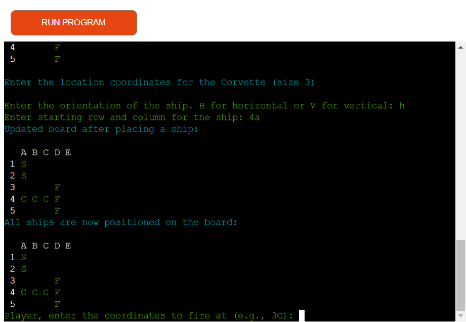

#### Test 5: Invalid Ship Placement

- Step: Attempt to place a ship outside the boundaries of the board or overlapping another ship.
- Expected Result: The game should reject the placement and prompt the player to choose a valid position.
- Actual Result: The game rejected the placement and prompted the user to choose a valid position.

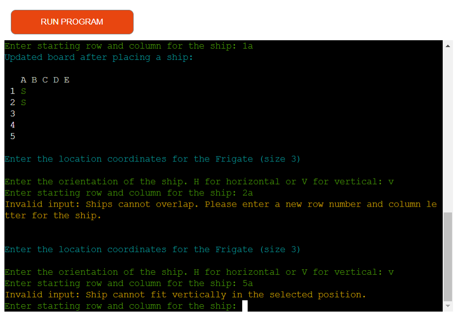

#### Test 6: Attack

- Step: Enter coordinates to attack.
- Expected Result: The game should update the board to reflect a hit or miss and display ammo remaining for the player and then the computer.
- Actual Result: The game updated the board to reflect a hit or miss and displayed ammo remaining for the player and the computer.

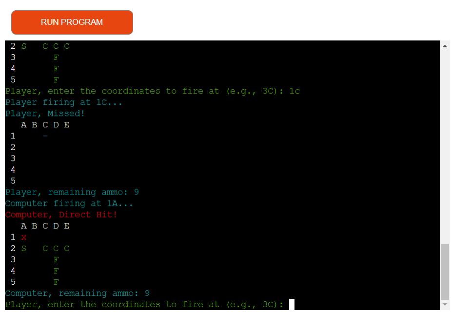

#### Test 7: Invalid Attack

- Step: Enter an invalid coordinate (e.g., letters instead of numbers then with the order reversed).
- Expected Result: The game should display a clear and consice error message and prompt for valid input.
- Actual Result: The game displayed a clear and consice error message and prompted for valid input.

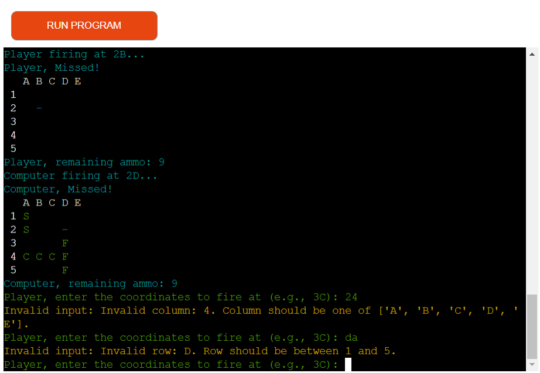

#### Test 8: Error Handling

- Step: Enter an invalid input (e.g., letter instead of numbers then reversed, symbols or blank inputs).
- Expected Result: The game should display a clear and consice error message and prompt for valid input.
- Actual Result: The game displayed a clear and consice error message and prompted for valid input.

#### Test 9: Game End

- Step: Continue playing until all ships of one player are sunk.
- Expected Result: The game should declare a winner and exit.
- Actual Result: The game declared a winner and exited.

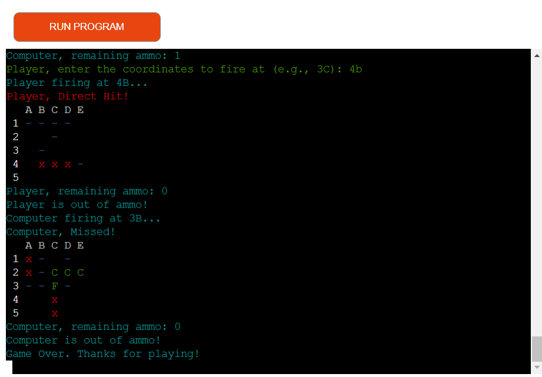

## Deployment

The site was deployed to Heroku using the following steps:

 1. Create a New Heroku App: Create a new application on Heroku.
 2. Config Vars: Set the config var to PORT=8000.
 3. Buildpacks: Set the buildpacks to Python and NodeJS (in that  order).
 4. Deployment: Link the Heroku app to the repository and click 'Deploy'

## Requirments

- Python 3.11
- Colorama library

## Credits

- Code Institute for template
- Code Institute for the deployment terminal.
- PEP8 Validator for code validation.