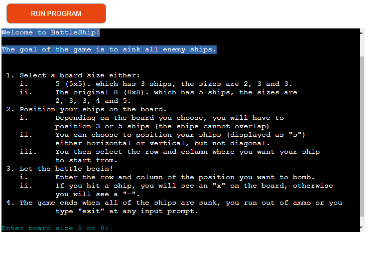

# Battleship Game - Solo-Play

Welcome to the Battleship Game! In this version of the Battleship game, you'll be challenging yourself to strategically place your fleet and take shots firing at the locations of the ships.

## Contents

* [Design](#design)
* [Playing the game](#playing_the_game)
* [Testing](#testing)
* [Validator testing](#valivador_testing)
* [Deployment](#deployment)
* [Requirements](#requirments)
* [Credits](#credits)

## Design

My design process consisted of thinking of each logic step in the game then creating a flowchart detailing the steps as seen below. 

### Playing the game

1. Open the game in your web browser.
2. Select the board size
3. Position your ships
4. Attack the ships

## Testing

I have manually tested this project by:

- I tested in my local terminal and on the Code Institute Heroku app.
- Passed the code through the pep8 validator.
- Gave invalid inputs: where numbers were expected I gave text and symbols and vis versa.

### Validator Testing

- PEP8
    - There were some errors, but when fixed and pasted back into my editor the program didn't work.

## Deployment

The site was deployed to Heroku.
- Create a new Heroku app.
- Set the config var to Port 8000.
- Set the buildpacks to Python and NodeJS in that order.
- Link the Heroku app to the repository.
- Click on Deploy

### Screenshots

The opening screen.

Error Handling.

## Requirments

The only requirments are that you are running python 3.11 and have colorama.

## Credits

- Code Institute for the deployment terminal.